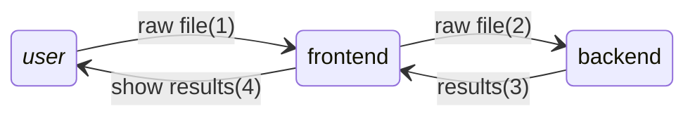

# **Web dev plan**
## Front-end (giao diện tương tác)
* Khung sườn: `index.html`
* Trang trí: `style.css`
* Logic tương tác: `script.js`
* Các file hình ảnh, âm thanh, video... nằm trong `assets/`

`style.css` và `script.js` có thể merge chung vào `index.html`
## Back-end (core xử lý)
- Logic chính: `app.py`
## Hợp đồng dữ liệu và luồng dữ liệu
* ***front-end*** nhận raw file từ ***user***, gửi cho ***back-end***
* ***back-end*** download về server, đặt trong `uploads/`
* ***back-end*** gọi executable `main_pipeline` để xử lý, xuất kết quả vào `results/`
* ***back-end*** gửi kết quả cho ***front-end***, show cho ***user***
