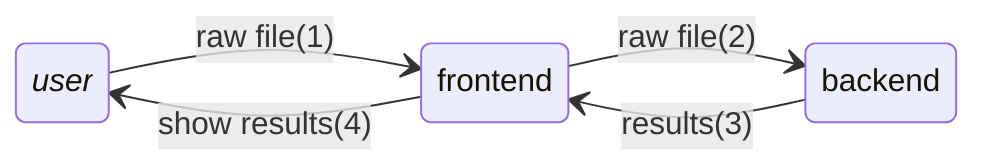

# **Web dev plan**
## Front-end (giao diện tương tác)
* Khung sườn: `index.html`
* Trang trí: `style.css`
* Logic tương tác: `script.js`
* Các file hình ảnh, âm thanh, video... nằm trong `assets/`

`style.css` và `script.js` có thể merge chung vào `index.html`
## Back-end (core xử lý)
- Logic chính: `app.py`
## Hợp đồng dữ liệu và luồng dữ liệu
### Hợp đồng
#### request từ front-end:
* method: `POST`
* url: `/api/analyze`
* Format: `multipart/form-data`
* Các trường của body:
    * `"uploadFile"`: file (binary) 
    * `"config"`: chuỗi cấu hình (theo format JSON)
        * `"delim"`, `"ignore"`, `"regex"`: chuỗi
        * `"frequencyPerc"`, `"lengthPerc"`, `"entropyPerc"`: số thực
        * `"visual"`: `"complete"`/`"partial"`/`"freq"`/`"len"`/`"entropy"`/ `"none"` (tạm thời bỏ qua)
#### response từ back-end (updated)
- status: trả về theo chuẩn http

- statusText: chuỗi thông báo nếu có lỗi hay không...

- body trả về chuỗi theo format json:
    * `"status"`: (có thể bỏ qua)
    * `"message"`: (có thể bỏ qua)
    * `"tableData"`: gồm nội dung các file csv dạng chuỗi
        * `"allEntries"`: toàn bộ nội dung file `all_entries.csv`
        * `"freqAnomalies"`: toàn bộ nội dung file `frequency_anomalies.csv`
        * `"lenAnomalies"`: toàn bộ nội dung file `length_anomalies.csv`
        * `"entropyAnomalies"`: toàn bộ nội dung file `entropy_anomalies.csv`
(tạm thời chỉ hiển thị các bảng biểu)
### Luồng dữ liệu
* ***front-end*** nhận raw file từ ***user***, gửi cho ***back-end***
* ***back-end*** download về server, đặt trong `uploads/`
* ***back-end*** gọi executable `main_pipeline` để xử lý, xuất kết quả vào `results/`
* ***back-end*** gửi kết quả cho ***front-end***, show cho ***user***

```mermaid
stateDiagram
    direction LR
    *user* --> frontend: raw file(1)
    frontend --> backend: raw file(2)
    backend --> frontend: results(3)
    frontend --> *user*: show results(4)
```

## Change log
* 4/2/26: Update hợp đồng response của backend 